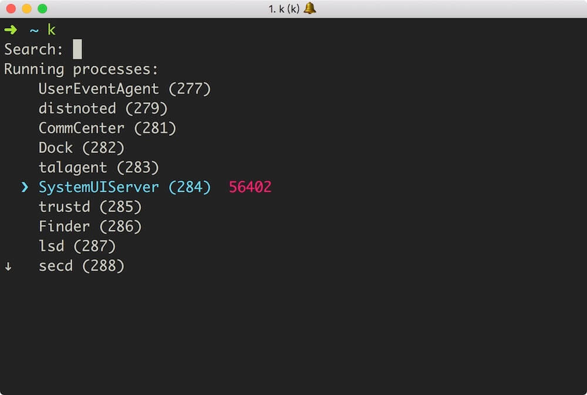

# K

K 是个 CLI 工具，提供简便的杀死进程的方法。K 基本是 [fkill-cli](https://github.com/sindresorhus/fkill-cli) 的 golang 版本，但不仅支持按进程名称，而且支持按 Pid、进程所监听的本地的端口来过滤。K 支持 Linux 和 macOS 系统。

## 安装和使用

go get github.com/codeudan/k 或者 从 release 下载可执行文件后输入 k 使用。

## 开发
git clone

go run k.go

go build
